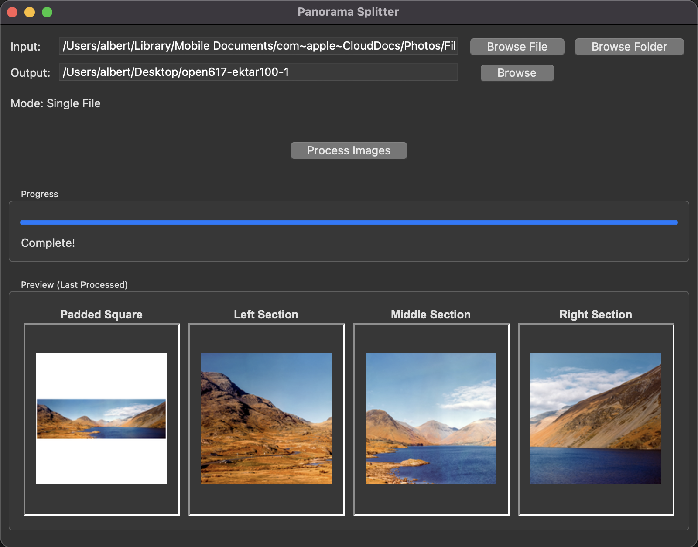

# Masking Frame



A masking frame is the darkroom device that holds printing paper under an
enlarger: adjustable blades mask the paper's edges, setting the format and
leaving a white border. This is that, for panoramas bound for Instagram.

It takes a panoramic JPG and creates:

1. **Bordered frame**: The full panorama, fitted inside the target output frame with a border on all sides and centered on the border colour. The border is a percent of the frame's short side — 9% by default, so it reads the same at every ratio — and whichever axis binds gets exactly that, with the other axis getting whatever's left over
2. **Detail frames**: A zoomed, cropped-and-resized view of a horizontal slice of the panorama, at the target aspect ratio. How many of these there are depends on the ratio and the panorama's shape — see [Aspect ratio](#aspect-ratio) below

## Features

- Process single panoramic images or entire folders
- Set the border width and colour, and the gap between composite panels
- Automatic resizing to maximize content at the chosen aspect ratio
- High-quality LANCZOS resampling for crisp output
- Maintains aspect ratio while maximizing visible content
- Batch processing with progress tracking
- Error handling for individual files in batch mode

## Requirements

- [mise](https://mise.jdx.dev) on macOS and Linux, or
  [uv](https://docs.astral.sh/uv/) on Windows

Everything else, including Python itself, is installed for you.

## Installation

**macOS / Linux**

```bash
mise install
mise run setup
```

**Windows**

```batch
install.bat
```

## Usage

**GUI:** `mise run gui` (or `run_gui.bat` on Windows). The window is a
two-tab notebook: **Split** for the single-panorama/batch workflow below,
and **Compose** for composing two to six photos into one frame
(see [Composites](#composites)).

**CLI:**

```bash
mise run split -- input.jpg my_prefix      # single image
mise run split -- ./panoramas ./output     # whole folder
mise run split -- compose a.jpg b.jpg -o my_prefix   # diptych
```

Run `uv run maskingframe --help` for all options, and
`uv run maskingframe compose --help` for the compose subcommand. Folder
mode writes to `./output` if you omit the output argument.

### Examples

1. **GUI mode:**
   ```bash
   mise run gui
   ```
   On the **Split** tab:
   - Pick "One frame" or "Whole folder", then click "Choose…" — the button
     opens a file picker or a folder picker to match
   - Pick a target ratio, and set the border if you want a different one
   - Click "Preview" to see the frames on the light table without writing
     anything
   - Click "Cut frames" to write them

   Switch to the **Compose** tab to compose two to six photos
   into one frame instead — see
   [Composites](#composites).

2. **CLI - single file:**
   ```bash
   mise run split -- vacation_pano.jpg --ratio 4:5
   ```
   Creates `output_1_padded.jpg` plus a variable number of
   `output_2_section1.jpg`, `output_3_section2.jpg`, ... — see
   [Aspect ratio](#aspect-ratio) for how many.

3. **CLI - custom prefix:**
   ```bash
   mise run split -- sunset.jpg hawaii_sunset --ratio 1:1
   ```
   Creates: `hawaii_sunset_1_padded.jpg`, `hawaii_sunset_2_section1.jpg`, etc.

4. **CLI - batch processing:**
   ```bash
   mise run split -- ~/Pictures/Panoramas ~/Pictures/Panoramas_Processed --ratio 1.91:1
   ```
   Processes every JPG in the folder once each and organizes outputs in the
   specified folder. If any file fails, the CLI exits non-zero and lists the
   failures on stderr; everything else in the batch still gets processed.

5. **CLI - compose:**
   ```bash
   mise run split -- compose left.jpg right.jpg -o seaside --ratio 1:1
   ```
   Creates `seaside_diptych.jpg`, and prints which arrangement won. Add more
   images, up to six, and the name follows: `_triptych`, `_tetraptych`,
   `_pentaptych`, `_hexaptych`. The output is the
   `-o` option rather than a trailing path, because a bare path after a list
   of images could be read as either another source or the destination.

## Aspect ratio

Instagram supports three feed shapes, and every image in a carousel must
share one. Pick the target with `--ratio`, using either the bare ratio or
its name (case-insensitive) — `--ratio 4:5` and `--ratio portrait` are
equivalent:

| Name | Ratio | Output size | Use |
| ---- | ----- | ----------- | --- |
| `portrait` | `4:5` | 1080x1350 | Default. Largest feed footprint. |
| `square` | `1:1` | 1080x1080 | Classic square. |
| `landscape` | `1.91:1` | 1080x566 | Landscape — Instagram's widest feed shape. |

The GUI combobox lists these as "Portrait (4:5)", "Square (1:1)", and
"Landscape (1.91:1)", in that order.

The first frame is the whole panorama on a white canvas. The frames after it
are a zoom, so viewers can see detail that is illegible in the first — and
how many there are is derived from the ratio and the panorama's shape, never
fewer than two.

Measured against 16 of the author's own scans: panoramas around 2.2-2.5:1
give 3 detail frames at 4:5, 2 at 1:1, and 2 at 1.91:1. Panoramas around
2.8-3.0:1 give 4, 3 and 2.

```bash
mise run split -- panorama.jpg my_prefix --ratio 4:5
mise run split -- ./panoramas ./output --ratio 1.91:1
```

Portrait images are rejected — this tool expects landscape panoramas. In a
batch the rejected file is reported and the rest continue.

## Border and gaps

The border is a percent of the frame's short side rather than a fixed pixel
count, so one setting reads the same at every ratio. The default is 9%: 97px
at `4:5` and `1:1`, 51px at `1.91:1`.

| Flag | Default | What it does |
| ---- | ------- | ------------ |
| `--border PERCENT` | `9` | Border width, as a percent of the frame's short side |
| `--border-colour HEX` | `#ffffff` | Border colour, e.g. `#c9302a` or `c9302a` |
| `--gutter PERCENT` | `4` | Composites only: the gap between panels |
| `--gutter-colour HEX` | `#ffffff` | Composites only: the colour of that gap |
| `--border-detail-frames` | off | Splits only: border the zoomed detail frames too, not just the first frame |
| `--frame1-border PERCENT` | same as `--border` | Splits only: give the first frame its own border, so it can fill more of the frame |

`--border-color` and `--gutter-color` work as well, if you prefer them. Every
flag in the table is accepted by both `maskingframe` and `maskingframe
compose`, because the two commands share one definition of them — but three
only do anything on one of the two. The gutter flags need panels to sit
between, and a composite has no detail frames to border.

On a composite the two colours cover different things: the gutter colour
fills only the strips between panels, and everything else — the outer margin
and the space left over from centring — takes the border colour.

Both tabs of the GUI have the same Border section, and each remembers what
you last set it to. Dragging a width draws the new border straight onto the
frames on the light table, so you can see it before anything is rendered.
When you let go, any preview already on the table is made again at the new
setting — the old picture stays up until the new one lands, rather than the
table going blank while you wait.

```bash
mise run split -- panorama.jpg my_prefix --border 12 --border-colour '#000000'
```

The first frame can have a border of its own, which is what to reach for when
it looks too small in the frame:

```bash
mise run split -- panorama.jpg my_prefix --frame1-border 2
```

That only moves the whole-panorama frame; the detail frames and any composite
keep the border `--border` names. Be aware there is a limit to what it can do.
A panorama is a much wider shape than a portrait frame, so at `4:5` a 2.33:1
panorama covers 23% of the first frame at the default border and 34% with no
border at all — the rest is the shape difference, not the border. At `1.91:1`
the same panorama already covers 67%.

## Composites

The second tab, and the `compose` subcommand, join two to six photographs
into a single frame at any of the three ratios.

The layout is chosen for you. An arrangement is a row or a column whose parts
are consecutive blocks of your images, each block either a single photograph or
a group stacked the other way — one level of grouping, so every arrangement is
a grid you would recognise. That gives 2, 6, 14, 30 and 62 arrangements for two
through six photographs, and the tool keeps whichever fills the frame best.
It reports the winner in notation: `R(1,C(2,3))` is photograph 1 beside
photographs 2 and 3 stacked.

You do not have to accept its choice. The Compose tab has an **Arrangement**
list — every arrangement, best fit first, in plain words with how much of the
frame each one fills — and the `compose` subcommand takes `--arrangement`:

```bash
mise run split -- compose a.jpg b.jpg c.jpg d.jpg -o out --arrangement R2.2
```

`R2.2` is a row of two blocks, two stacked then two stacked. The letter is the
direction the blocks run in — `R` across, `C` down — and the numbers are how
many photographs are in each, which must add up to how many you gave it. Every
run prints the flag for the arrangement it used, so you can put the same one
back:

```text
Wrote out_tetraptych.jpg as R(C(1,2),C(3,4)) at Portrait (4:5)
  --arrangement R2.2
```

The long form works too, but a shell needs it quoted. Panels are never
cropped: each keeps its own aspect ratio, and whatever space is left over
becomes border. That is what lets a 6x17 panorama, a square 6x6 and a
35mm frame sit in one composite without any of them losing content.

Images stay in the order you arrange them. In the GUI, use Up and Down to
change it; on the command line, the order you list them is the order used.

Unlike the splitter, portrait images are fine here — mixing orientations is
much of the point.

## Output Details

### Output 1: Bordered frame

- Contains the entire panorama, fitted (never cropped) inside the target
  output frame with a border on all sides and centered on a canvas already
  sized to the target output size (same pixel dimensions as the detail
  frames) — a large-format scan doesn't produce a multi-megabyte first frame
  beside sub-megabyte detail frames
- At the default `4:5` ratio, most of the canvas is border by design —
  that's the intended aesthetic, not a bug
- Whichever axis binds gets exactly the border — normally the width, but a
  panorama flatter than the inset box binds on height instead — and the
  other axis gets whatever's left over, usually much more (this is
  deliberate, and locked in place by tests)
- Only square when you ask for `1:1`
- Ideal for Instagram gallery posts

### Outputs 2+: Detail frames

- Each detail frame is exactly the target ratio's output size (e.g.
  1080x1350 at `4:5`)
- The panorama is divided into that many equal horizontal slices; each slice
  is scaled to cover the target size and center-cropped to fit exactly
- Perfect for Instagram carousel posts

## Tips

- Works best with horizontal panoramic images
- Output quality is set to 95% JPEG compression for optimal file size vs quality
- The tool automatically handles various panorama aspect ratios
- For vertical panoramas, consider rotating before processing

## Troubleshooting

- **"No JPG files found"**: Ensure your input folder contains files with .jpg, .JPG, .jpeg, or .JPEG extensions
- **"Error processing image"**: Check that the file is a valid image format and not corrupted
- **Memory issues**: Very large panoramas may require more RAM; consider processing one at a time

## License

This tool is provided as-is for personal and commercial use.